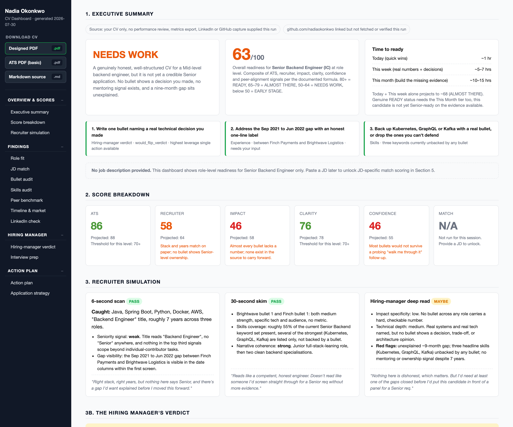
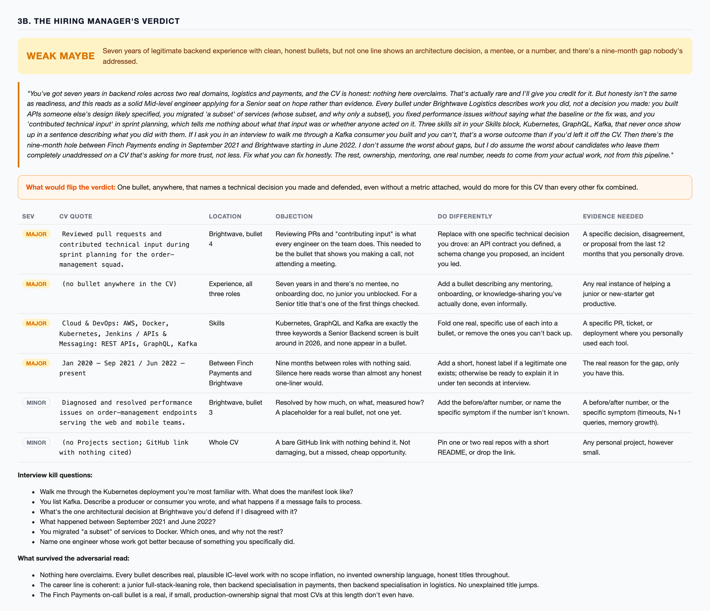
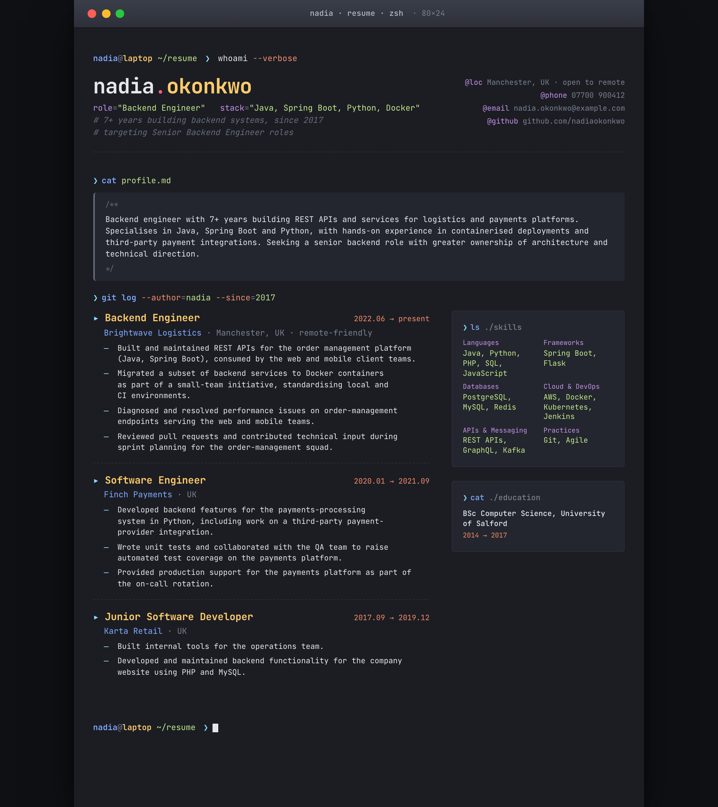
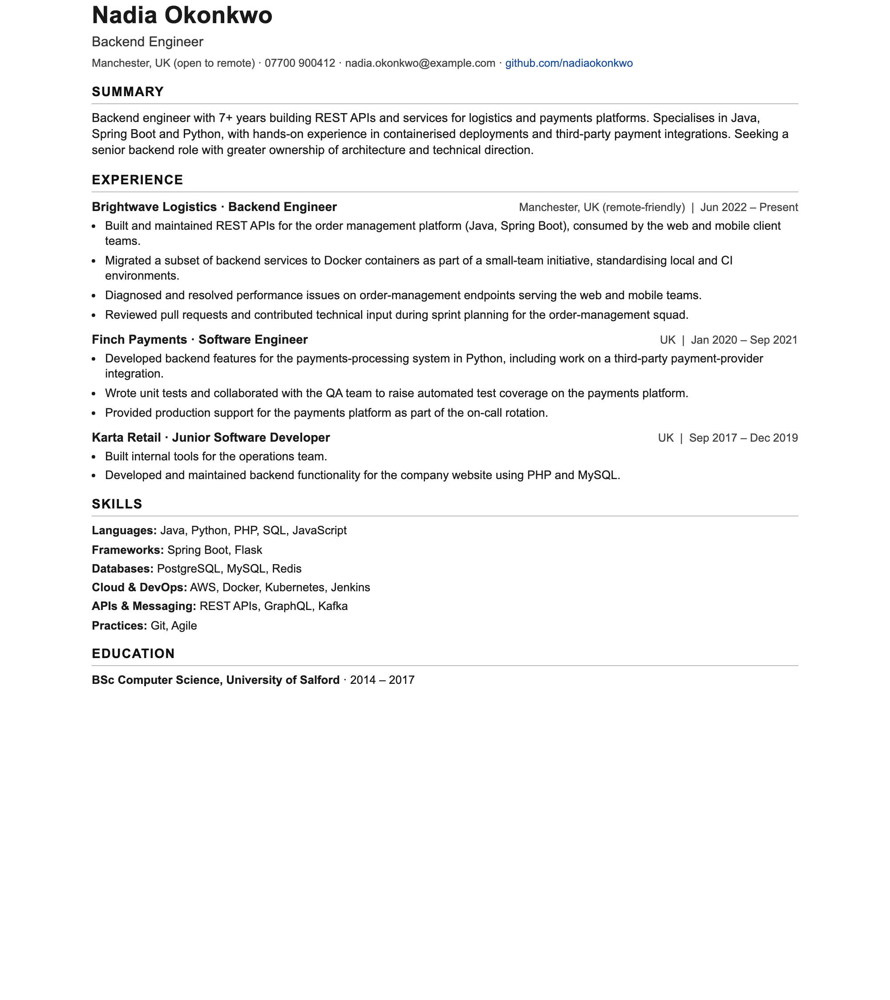

# Demo pack: an example CV Coach run

This folder is a complete, real run of CV Coach on a **fictional** candidate, so you can see exactly what the agent produces without running it yourself. Every name, company, and number here is made up.

## The scenario

**Nadia Okonkwo** is a mid-level backend engineer with about 7 years of experience, applying for a **Senior Backend Engineer** role. Her CV is deliberately average: honest but thin. It has the kind of gaps CV Coach is built to catch:

- bullets that describe duties, not impact (no metrics anywhere)
- no leadership, mentoring, or architecture-ownership signal, which a senior role expects
- an unexplained 9-month employment gap
- skills listed but never demonstrated in a bullet (Kubernetes, GraphQL, Kafka)
- a generic summary that could belong to anyone

## What it looks like

The dashboard, top of page: verdict, score, time to ready, and the three highest-leverage fixes.

The hiring manager's adversarial read, with every objection filed against the line it attaches to.

The rewritten CV, designed and ATS-safe.

| Designed PDF | ATS-safe PDF |
|---|---|
|  |  |

More screenshots, including the bullet audit, peer benchmark and action plan, are in the [main README](../README.md#what-it-looks-like).

## What is in this folder

| File | What it is |
|------|------------|
| `Nadia-Okonkwo-input-cv.md` | The original CV that was fed in (the "before"). |
| `Nadia-Okonkwo-CV.md` | The rewritten CV, Markdown source. |
| `Nadia-Okonkwo-CV-ats.pdf` | ATS-safe PDF: plain layout, system fonts, parses cleanly in applicant-tracking systems. |
| `Nadia-Okonkwo-CV.pdf` | Designed PDF: the styled version to send to a human. |
| `Nadia-Okonkwo-CV-ats.html`, `Nadia-Okonkwo-CV.html` | The HTML the PDFs are rendered from. |
| `Nadia-Okonkwo-CV-dashboard.html` | The dashboard. Open this first: scores, recruiter simulation, the hiring-manager verdict, a bullet-by-bullet audit, a peer benchmark, and a tiered action plan. |
| `Nadia-Okonkwo-CV-change-report.md` | What the original CV lacked, what changed, and what to gather next. |
| `Nadia-Okonkwo-CV-verdict.json` | The raw hiring-manager verdict output. |

## The outcome

CV Coach scored this candidate honestly rather than flattering her:

- **Overall readiness: 63 / 100 (NEEDS WORK)**
- ATS 86, Recruiter 58, Impact 46, Clarity 76, Confidence 46
- **Hiring-manager verdict: weak_maybe** - *"Seven years of legitimate backend experience with clean, honest bullets, but not one line shows an architecture decision, a mentee, or a number, and there's a nine-month gap nobody's addressed."*
- Highest-leverage fix: *"One bullet, anywhere, that names a technical decision you made and defended, even without a metric attached, would do more for this CV than every other fix combined."*

That is the point of the tool: it tells you where you actually stand for the role you are targeting, and exactly what to fix first.

> The screenshots above cover the output, so there is nothing you need to download to see it. The HTML files are here if you want the interactive version: download them and open in a browser. To regenerate the PDFs or make your own, see the main [README](../README.md).
